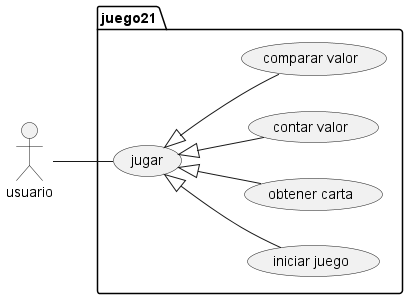
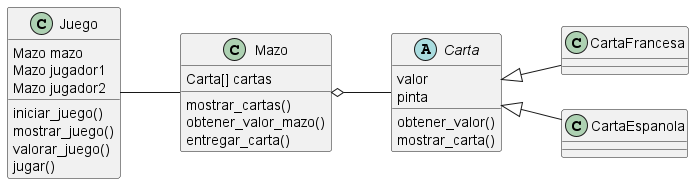

# Ventiuna
El juego de 21 es un juego de cartas, con una o más barajas permite a dos jugadores pedir cartas hasta estar lo más próximo al valor de 21 sin pasarse.

En esta versión simularemos un 21 de un jugador vs. el repartidor.

El repartidor estará obligado a pedir cartas hasta igualar al jugador y solo se plantará cuando lo iguale o supere.

El jugador solo podrá ganar si tine major puntaje que el repartidor pero sin pasarse de 21.

Las cartas numéricas suman su valor, las figuras como __"J, Q, K"__ suman 10 y el As vale 1 o 11 según convenga, solo puede valer 11 si con este valor no excede el valor de 21, de lo contrario, suma 1.

## Diagramas:

- Diagrama de casos de uso:

- Diagrama de clases:

- Diagrama de secuencia:

## Colaboradores del proyecto:
+ Samuel Casas Cantor / 20231020038.
+ Luis Felipe Mongui Dimate / 20231020039.
+ Juan Diego Lozano Luna /20231020040.